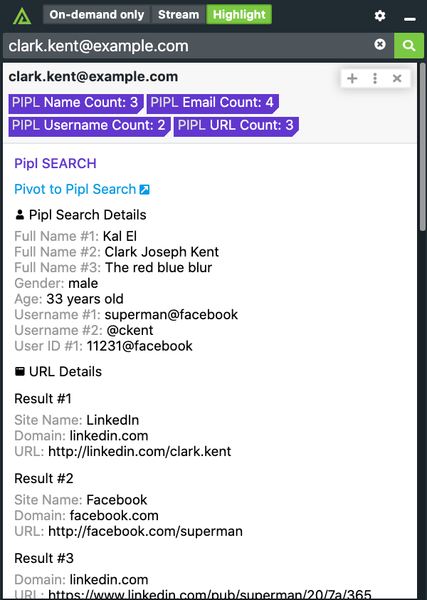

# Polarity Pipl Integration

The Polarity Pipl integration allows the Polarity user to quickly perform research against persons of interest via email address and telephone number recognition.

Check out the integration below: 

|  |
|---|
|Pipl Example|

## Pipl Integration Options

### Pipl API Url 
The base URL for the Pipl REST API including the schema (i.e., https://). The default is set to https://api.pipl.com.

### Pipl API Key 
API key used to query Pipl's rest API.

## Installation Instructions

Installation instructions for integrations are provided on the [PolarityIO GitHub Page](https://polarityio.github.io/).

## Polarity

Polarity is a memory-augmentation platform that improves and accelerates analyst decision making.  For more information about the Polarity platform please see:

https://polarity.io/
